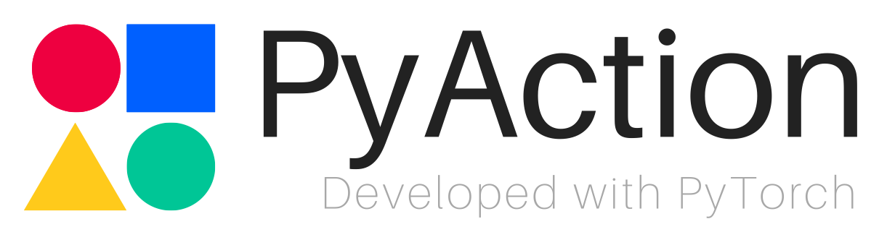

# Introduction
A Toolkit for Video Action Recognition(Classification/Detection)
PyAction is an open source video action recognition codebase from PLUS Group that provides state-of-the-art video action classification/detection models.

Our codebase is built on the top of [SlowFast](https://github.com/facebookresearch/SlowFast).

<!-- PySlowFast is an open source video understanding codebase from FAIR that provides state-of-the-art video classification models, including papers "[SlowFast Networks for Video Recognition](https://arxiv.org/abs/1812.03982)", and "[Non-local Neural Networks](https://arxiv.org/abs/1711.07971)". 

<div align="center">
  
</div> -->
# Logs
- Main Code Release, configuration will be updated soon.
- Initialize the Project, Code & Model will come soon.

# Highlights
- **Remove all registry mechanism**
- **User-friendly config without `yacs`**
- **Folder-based Experiments Management**

# Supported Models

- C2D
- I3D
- Non-local Network
- SlowFast 
- SlowOnly


# License

PyAction is released under the [Apache 2.0 license](LICENSE). 

# Model Zoo and Baselines

We provide a large set of baseline results and trained models available for download in the PySlowFast [Model Zoo](MODEL_ZOO.md).

# Installation

Please find installation instructions for PyTorch and PyAction in [INSTALL.md](INSTALL.md). You may follow the instructions in [DATASET.md](pyaction/datasets/DATASET.md) to prepare the datasets.

# Quick Start

Follow the example in [GETTING_STARTED.md](GETTING_STARTED.md) to start playing video models with PySlowFast.

# Related Works

```latex
@inproceedings{zhang2021itanet,
  title={Learning Implicit Temporal Alignment for Few-shot Video Classification.},
  author={Zhang, Songyang and Zhou, Jiale and He, Xuming},
  booktitle={IJCAI},
  year={2021}
}
```